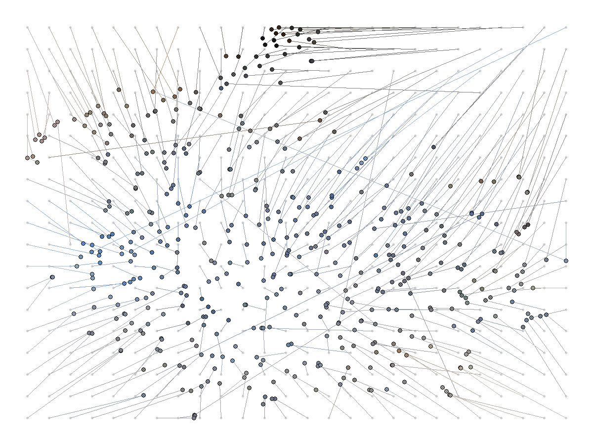
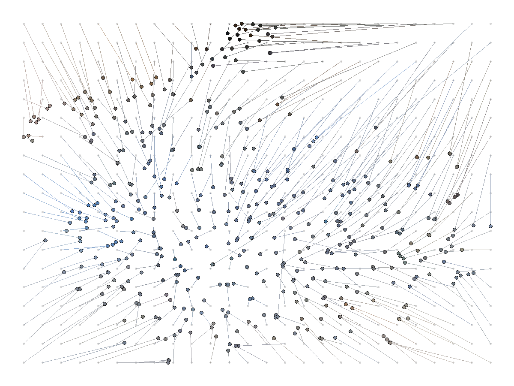
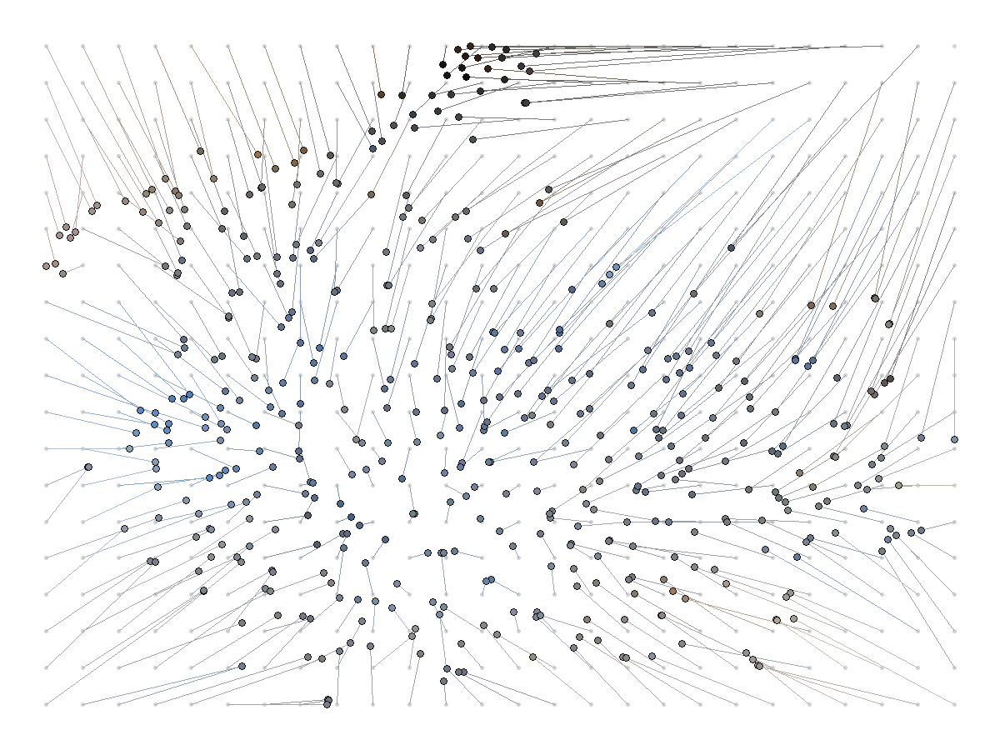

# Sinkhorn vs Hungarian Assignment

Small benchmark and report comparing Hungarian assignment with Sinkhorn
transport for root-tracking-style matching problems.

## Contents

- `sinkhorn.Rnw`: report source.
- `sinkhorn.pdf`: rendered report.
- `sinkhorn_benchmark.py`: NumPy-only Hungarian/Sinkhorn benchmark.
- `root_tracking_benchmark.py`: synthetic complex-root tracking benchmark.
- `sinkhorn_mt.c`: pthread-based C Sinkhorn and serial C Hungarian routines.
- `sinkhorn_mt_benchmark.py`: Python `ctypes` benchmark wrapper for the C code.
- `image_grid_sinkhorn.py`: image feature extraction, t-SNE embedding, Sinkhorn
  grid snapping, and mosaic rendering.
- `sinkhorn.md`: implementation plan and notes from the sketch phase.

## Python Setup

```bash
uv sync
```

## Run Benchmarks

Python/NumPy benchmark:

```bash
uv run python sinkhorn_benchmark.py
```

C benchmark:

```bash
uv run python sinkhorn_mt_benchmark.py --build --cost-kind sorted-1d
uv run python sinkhorn_mt_benchmark.py --build --cost-kind dense
uv run python sinkhorn_mt_benchmark.py --build --cost-kind flat
```

## Build Image Mosaic

The example Andros thumbnail set is included in `andros_thumbnails/`. To
recreate the mosaics and comparison outputs, run:

```bash
uv run python image_grid_sinkhorn.py \
  --input andros_thumbnails \
  --out outputs/andros_sinkhorn_mosaic.png \
  --layout outputs/andros_sinkhorn_layout.csv \
  --debug outputs/andros_sinkhorn_debug.png \
  --hungarian-debug outputs/andros_hungarian_debug.png
```

The script extracts simple visual features, runs PCA followed by t-SNE, solves a
log-domain Sinkhorn transport problem from embedding coordinates to grid
coordinates, and rounds the soft plan into a one-image-per-cell layout. It also
computes the exact Hungarian grid assignment on the same embedding and writes:

- `outputs/andros_sinkhorn_mosaic.png`
- `outputs/andros_hungarian_mosaic.png`
- `outputs/andros_sinkhorn_debug.png`
- `outputs/andros_hungarian_debug.png`
- `outputs/andros_sinkhorn_vs_hungarian.png`
- `outputs/andros_sinkhorn_vs_hungarian_marked.png`
- `outputs/andros_sinkhorn_vs_hungarian.csv`

In the marked comparison image, red boxes indicate grid cells whose contents
differ between the rounded Sinkhorn layout and the exact Hungarian layout.
The `outputs/` directory is generated and is intentionally not tracked.

### Assignment Cost

The table below counts the grid-assignment step after features and t-SNE have
already been computed. Let `n` be the number of images, `m` the number of grid
cells, `T` the number of global Sinkhorn iterations, `k_r` and `l_r` the number
of images and candidate cells in repair round `r`, and `R` the number of repair
rounds. In this mosaic, `m` is usually close to `n`.

| Method | Computational cost | Memory | Result |
|---|---:|---:|---|
| Greedy Sinkhorn | `O(T n m) + O(n m log m)` | `O(n m)` | Fast soft transport, then greedy one-to-one rounding. Approximate. |
| Recursive Sinkhorn | `O(T n m) + sum_r O(T k_r l_r) + optional O(k^3)` | `O(n m) + O(max_r k_r l_r)` | Starts from Sinkhorn argmax and repairs duplicate cells locally. Approximate unless the final local Hungarian fallback is used. |
| Full Hungarian | `O(n^2 m)`, or `O(n^3)` when `m ~= n` | `O(n m)` | Exact minimum-cost one-to-one assignment. |

### Example Debug Plots

Greedy Sinkhorn rounded assignment:



Recursive Sinkhorn repair assignment:



Hungarian exact assignment:



### Sinkhorn vs Hungarian Grid Assignment

The image below shows the rounded Sinkhorn layout on the left and the exact
Hungarian layout on the right. Red boxes mark cells where the image differs
between the two assignments.


## Rebuild Report

```bash
Rscript --vanilla -e "knitr::knit('sinkhorn.Rnw', output='sinkhorn.tex')"
pdflatex -interaction=nonstopmode sinkhorn.tex
```
